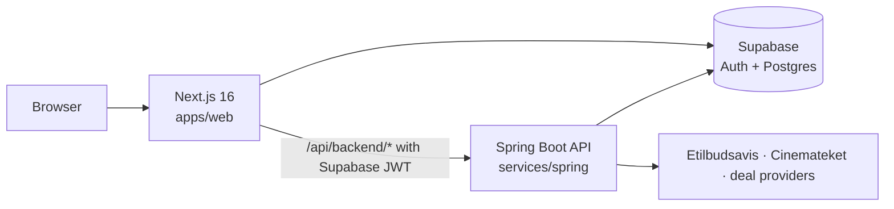

<p align="center">
  
</p>

<h1 align="center">The Hub</h1>

<p align="center">
  A personal dashboard of live widgets for grocery deals, uptime checks, deal-day countdowns and cinema listings.<br/>
  Built as a full-stack monorepo on Next.js, Spring Boot and Supabase.
</p>

<p align="center">
  
  
  
  
  
  
</p>

<p align="center"><a href="https://skjellevik.online"><strong>skjellevik.online</strong></a></p>

---

## What it does

Sign in, add widgets and arrange them on a responsive grid. Each widget has its own settings for each user and pulls live data through the API.

| Widget | What it shows |
| --- | --- |
| **Grocery Deals** | A saved search across Norwegian grocery flyers (Etilbudsavis), filtered by location, so you don't have to check each store yourself. It can optionally use Gemini to filter results by relevance. |
| **Server Pings** | HTTP status and latency for one or more URLs. |
| **Countdown** | Time until the next Trippel Trumf or DNB Supertilbud day. The backend scrapes the dates from the provider, and admins can confirm or deny them. |
| **Cinemateket** | Upcoming screenings at Cinemateket Trondheim. Listings are cached and refreshed nightly. |

The app also has:

- **Monster case opening**: a CS:GO-style case opener for energy drinks. It has rarity tiers, animated rollers, a live drop feed and stats, and the server makes every roll.
- **Admin panel**: user roles, widget management and countdown date overrides.
- **Authentication**: email/password or GitHub OAuth through Supabase, with Cloudflare Turnstile on the auth forms.
- **Localisation and theming**: every page is available in English and Norwegian, with light and dark themes.

## How it's built



- **API calls go through Next.js.** A catch-all route handler forwards requests to Spring Boot and attaches the user's Supabase access token. The API checks that token as an OAuth2 resource server.
- **Widgets are typed modules.** Each widget kind has a Zod settings schema, a fetcher and a view, and a discriminated union ties them together. Adding a widget takes one frontend module and one backend package.
- **Upstream data is cached.** Cinemateket listings and countdown dates are stored in Postgres, so a dashboard load doesn't scrape the upstream sites.
- **Monitoring is built in.** The frontend reports errors to Sentry. The API writes structured JSON logs and has request IDs, Micrometer metrics and Actuator health checks.
- **Schema changes are migrations.** SQL migrations live in `supabase/migrations`, and CI applies them when they merge to `main`.

## Tech stack

| Layer | Stack |
| --- | --- |
| Frontend | Next.js 16 (App Router, Turbopack), React 19, TypeScript, Tailwind CSS 4, TanStack Query, next-intl, React Hook Form + Zod |
| Backend | Spring Boot 3.5, Java 21, Spring Security (OAuth2 resource server), Spring JDBC, SpringDoc OpenAPI |
| Data and auth | Supabase (Postgres, Auth) |
| Quality | Vitest + Testing Library, JUnit, ESLint, Prettier, Checkstyle, Spotless |
| Delivery | Docker, GitHub Actions, GitHub Container Registry, Sentry |

## Repository layout

```
apps/web/          Next.js frontend
services/spring/   Spring Boot API
supabase/          Supabase config and SQL migrations
docs/              Project documentation
compose.yaml       Local development stack
```

## Getting started

**Prerequisites:** Node.js 24 (see `.nvmrc`), pnpm 10.28.1, JDK 21 and a Supabase project. Docker is optional.

```bash
git clone https://github.com/eriskjel/the-hub.git
cd the-hub
npm install --global pnpm@10.28.1
pnpm install
```

### Environment

**Backend:** copy `services/spring/.env.example` to `services/spring/.env`, then set the datasource and the Supabase JWT secret. `GEMINI_API_KEY` is optional.

**Frontend:** create `apps/web/.env.local`:

```bash
NEXT_PUBLIC_SITE_URL=http://localhost:3000
NEXT_PUBLIC_SUPABASE_URL=...
NEXT_PUBLIC_SUPABASE_ANON_KEY=...
SUPABASE_SERVICE_ROLE_KEY=...        # server-only; never prefix with NEXT_PUBLIC_
BACKEND_URL=http://localhost:8080    # use http://api:8080 under Docker Compose
```

Sentry (`SENTRY_*`, `NEXT_PUBLIC_SENTRY_DSN`) and Turnstile (`NEXT_PUBLIC_TURNSTILE_SITE_KEY`, `TURNSTILE_SECRET_KEY`) are optional in development. Production requires Turnstile.

### Run

```bash
docker compose up    # web on :3000, API on :8080, both with hot reload
```

Or run each side directly:

```bash
pnpm dev                                        # frontend
cd services/spring && ./mvnw spring-boot:run    # API
```

With the `dev` profile, the API docs are at http://localhost:8080/swagger-ui.

## Scripts

| Command | Description |
| --- | --- |
| `pnpm dev` | Next.js dev server (Turbopack) |
| `pnpm build` | Production build of the frontend |
| `pnpm lint` | ESLint |
| `pnpm test` | Vitest in watch mode (`test:run` for a single run, `test:ui` for the UI) |
| `./mvnw verify` | Backend tests plus Checkstyle and Spotless checks (run from `services/spring`). PostgreSQL tests run when `HUB_TEST_DATABASE_URL` is set. |

## CI/CD

| Workflow | Trigger | What it does |
| --- | --- | --- |
| `web-ci` | PRs to `main` | Prettier check, Vitest, Next.js build |
| `backend-ci` | PRs to `main`, backend changes on `main`, manual | Checkstyle, Spotless and tests against a throwaway PostgreSQL, then builds the API image. On `main`, pushes multi-arch images to GHCR |
| `main.yml` | Migration changes on `main` | Applies Supabase migrations to production |

Web and backend CI check whether their part of the repo changed and skip the heavy jobs if it didn't, but they still report the required checks. The API image is built only after verification passes. A new commit on a PR cancels that PR's older runs, but a deployment that has already started on `main` always finishes.

## Contributing

PRs are welcome. Branch from `main`. PRs are squash-merged once CI passes. See [docs/merging.md](docs/merging.md) for the full workflow.

## License

[MIT](LICENSE)
